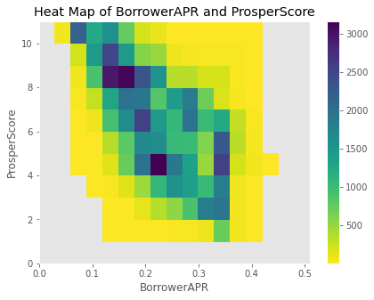

# Prosper Loan Analysis

**Exploring 113,937 loans through univariate, bivariate, and multivariate visualization.**

[Open the notebook](exploration%20%28with%20jitter%29.ipynb) · [Preview](#preview) · [Reproduce](#reproduce-the-analysis)

## Preview

The following chart is an existing saved output from the notebook, extracted without rerunning or changing the data.



## Project story

**Problem.** A wide loan dataset is difficult to interpret without narrowing the questions and examining distributions before comparing groups.

**Approach.** Start with 81 variables, select 31 columns of interest, clean data types, and explore borrower APR, ProsperScore, income, loan amount, and employment status with pandas, Matplotlib, and Seaborn.

**Current result.** A notebook with saved charts and written observations. The work demonstrates exploratory analysis and visual communication; it is not a predictive credit model or evidence of causal effects.

## Findings explored

- The saved analysis shows a negative association between ProsperScore and borrower APR.
- Income and loan amounts have long-tailed distributions; log scales and explicit axis limits reveal patterns obscured in the original views.
- The notebook compares APR and risk-score distributions across employment groups and loan statuses.
- Time plots describe loan origination patterns in the historical dataset, not current lending conditions.

These are descriptive observations. Missing values, group sizes, selected axis limits, and the age of the source data affect interpretation.

## Analysis flow


## Reproduce the analysis

The CSV is **not included**. Obtain the original `prosperLoanData.csv` dataset separately and place it beside the notebook. The saved outputs remain readable on GitHub without the CSV.

```sh
python -m venv .venv
source .venv/bin/activate
python -m pip install jupyter pandas numpy matplotlib seaborn
jupyter notebook
```

Open `exploration (with jitter).ipynb` and review the cells before running them. This older notebook has no dependency lockfile; recent pandas/Seaborn releases may require API adjustments. Some plots use random samples without a fixed seed, so regenerated figures can differ.

## Tools and artifacts

Python · pandas · NumPy · Matplotlib · Seaborn · Jupyter

- [Complete notebook with saved outputs](exploration%20%28with%20jitter%29.ipynb)
- [Loan amount distribution](docs/chart-0.png)
- [License](LICENSE)
